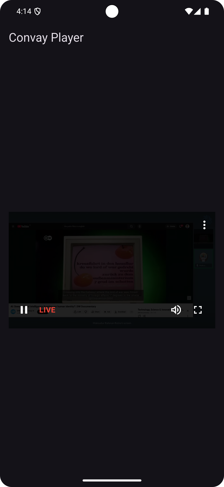
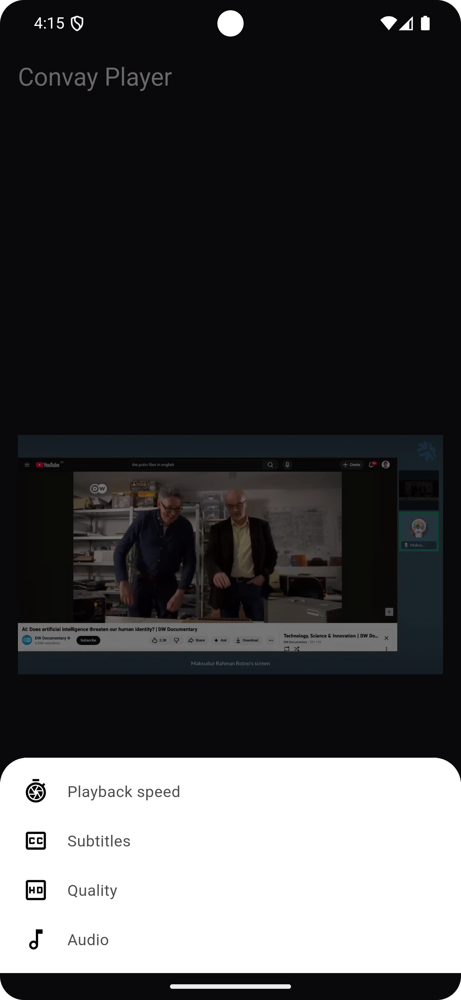

# Convay Hls Player

Convay Hls Player is a Flutter plugin for playing HLS (HTTP Live Streaming) on Android and iOS using platform-native players. It offers a simple API with smooth, adaptive, and reliable playback across different network conditions, along with token refresh support for seamless live and on-demand streaming.

## Features

- HLS Streaming: Plays HLS (m3u8) video streams.
- Token Authentication: Automatic token refresh for secure playlist access.
- Quality Selection: Manual quality/bitrate selection with adaptive bitrate support.
- Low Latency: Configured for low-latency streaming.
- Error Recovery: Automatic error handling and recovery for network and media errors.
- Customizable controls: Play, pause, fullscreen, mute, quality selection.
- Supports landscape and portrait mode.
- Works on iOS and Android.

## Installation

Add the dependency in your `pubspec.yaml`:

```
dependencies:
  convay_hls_player: latest_version
```

Run:

```
flutter pub get
```

Import the package:

```
import 'package:convay_hls_player/convay_hls_player.dart';
```

## Example

Run the example app:

```
cd example
flutter run
```

## Screenshots

<p>
  
  
  
</p>

## Usage


Use the `ConvayHlsPlayer` widget:

```
import 'package:http/http.dart' as http;
import 'dart:convert';

ConvayHlsPlayer(
  streamUrl: 'https://example.com/stream.m3u8',
  tokenRefreshMethod: () async {
    final response = await http.post(
      Uri.parse(playlistAccessUrl),
      headers: const {'Content-Type': 'application/json'},
      body: jsonEncode({'stream_id': _streamId}),
    );
    // Parse response to extract token + expiration.
    return const ConvayHlsToken(
      playlistToken: 'your-token',
      playlistExpiry: 1700000000,
    );
  },
  abrEnabled: true,
  isLive: true,
  autoPlay: true,
)
```

## Props

`ConvayHlsPlayer` supports the following properties:

- `streamUrl` (String, required): HLS master playlist URL (m3u8).
- `tokenRefreshMethod` (Future<ConvayHlsToken> Function(), required): Callback used to refresh HLS tokens.
- `abrEnabled` (bool, default: true): Enables adaptive bitrate and quality selection.
- `playlistRefreshThreshold` (int, default: 15): Seconds before expiry to refresh tokens.
- `autoPlay` (bool, default: true): Starts playback automatically.
- `muted` (bool, default: false): Starts the player muted.
- `isLive` (bool, default: false): Enables live-stream behavior (live edge handling).


## Notes

- `lib/convay_hls_player.dart` contains the widget and refresh logic.
- The Android and iOS player updates HLS tokens without interrupting playback.

## Important Note

- Supports only m3u8 URLs for HLS streaming. Other formats are not supported.
- On iOS Simulators and Android Emulators, the player may not function correctly. Please use a physical device for accurate testing.

## License

MIT License. See `LICENSE` for details.
